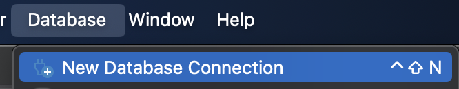
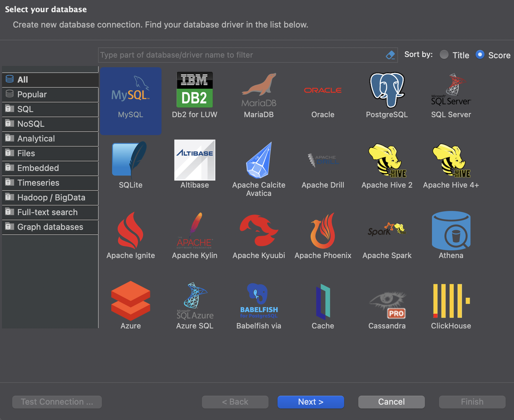
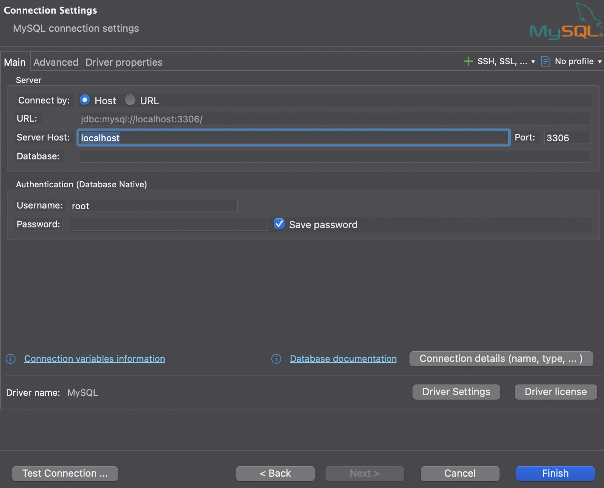
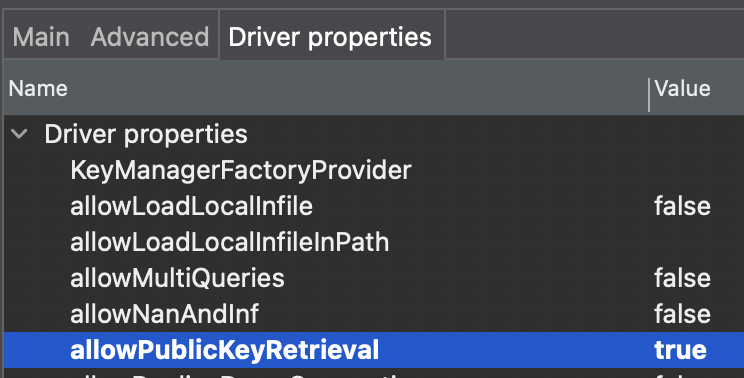

# DB란

오늘 사용할 **mysql**이란 데이터베이스는 관계형 데이터베이스로, 엑셀과 비슷한 환경이라 생각하면 된다.

하지만, 다양한 쿼리를 통해 훨씬 빠른 속도로 데이터에 접근이 가능하고, 수만개에 가까운 대량의 데이터도 처리 가능하다.

오늘은 이런 장점들이 있어서 대규모 서버에서 활용하는 데이터베이스를 다뤄보자.

# MySql 설치?

최근 서버는 도커로 돌아가는 성향이 강하다.

굳이 설치해서 쓰기 보다는 mysql 이미지를 pull해 사용해보도록 하자.

# DBeaver

DataBase를 엑셀처럼 보기 쉽고, 편집하기 쉽게 바꿔주는 앱이다.

그게 전부이지만, 일반적으론 쿼리를 통해 데이터베이스를 다루는 것을 생각하면 정말 유용한 도구이다. (특히 시각화)

Step-by-Step 으로 설치부터, 데이터베이스 연결까지 해보자.

## DBeaver 설치

- 알아서 해오세요.

## DataBase 선택

를 누른 후,

에서 **MySql**을 선택해주자.

## DB 연결

에선 열려있는 서버의 주소를 입력, 데이터베이스의 비밀번호도 입력해준다.

**Driver properties**에서 가끔씩 에러가 날 수 도 있어서 allowPublickeyRetrival을 true로 바꿔주자.

# 사용 준비 완료

이제 DB를 사용할 준비가 완료됐다.

사실 DBeaver로 하나하나 편집하는 것은 불편하기에, 보통 서버나 프로그래밍 언어로 데이터베이스에 연결해 쿼리를 날리는 방식으로 사용한다.

다양한 쿼리를 공부하며 데이터베이스의 데이터들을 조회하고 편집하며 생산성을 높혀보자.